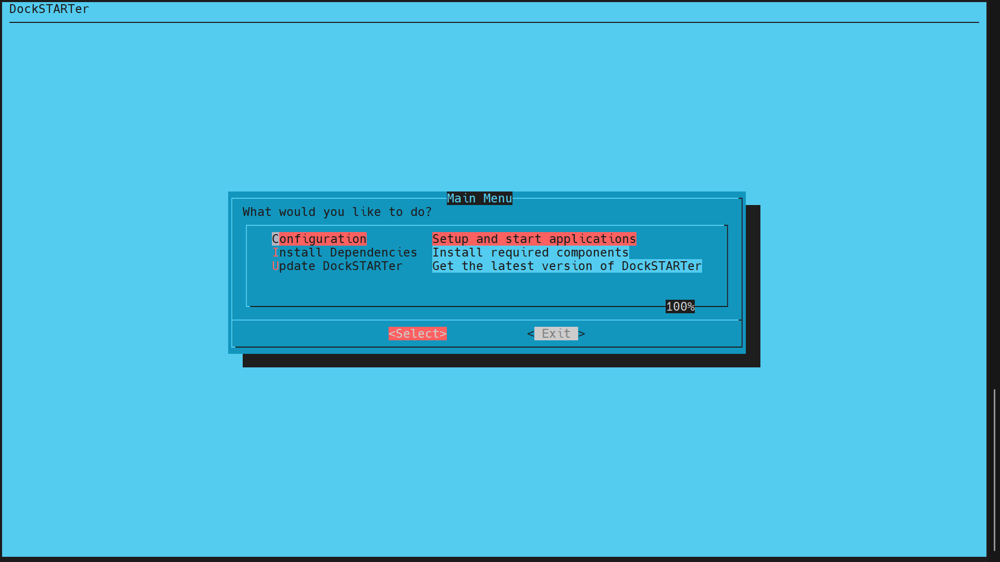
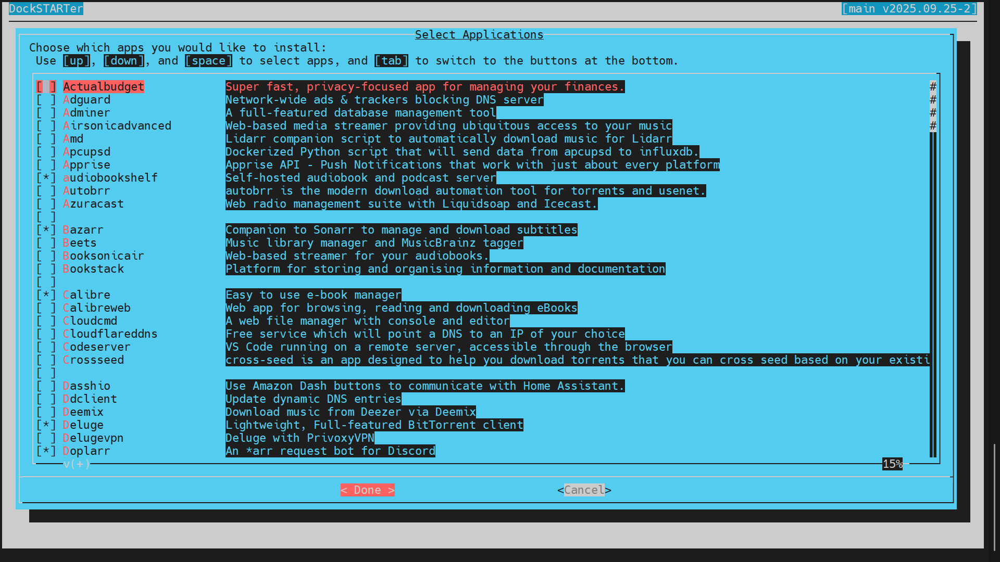
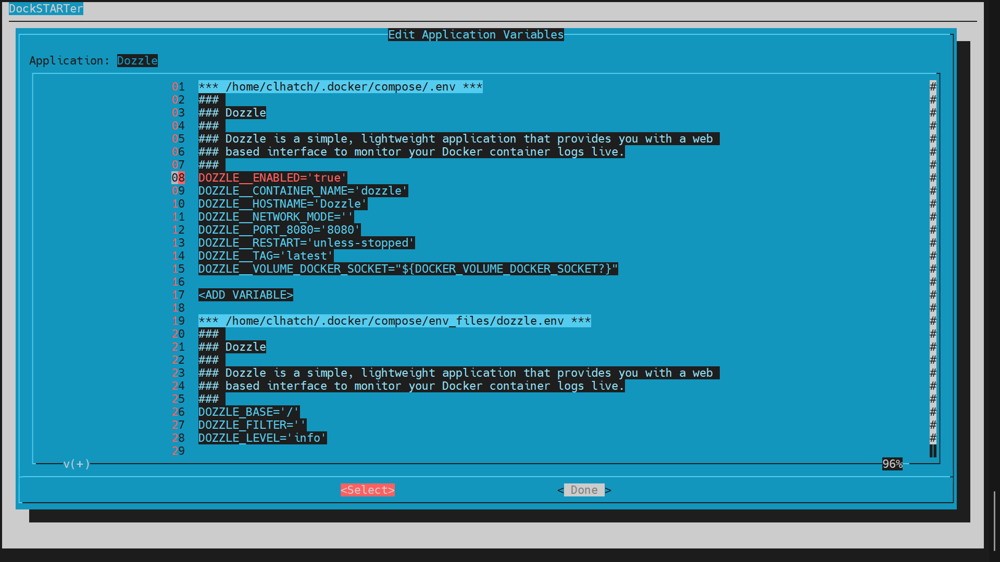
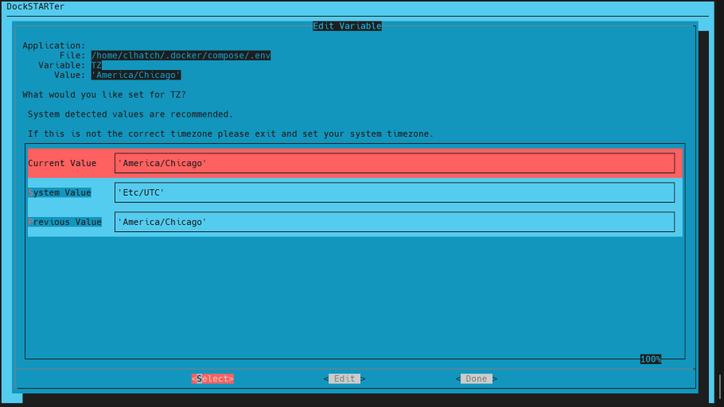
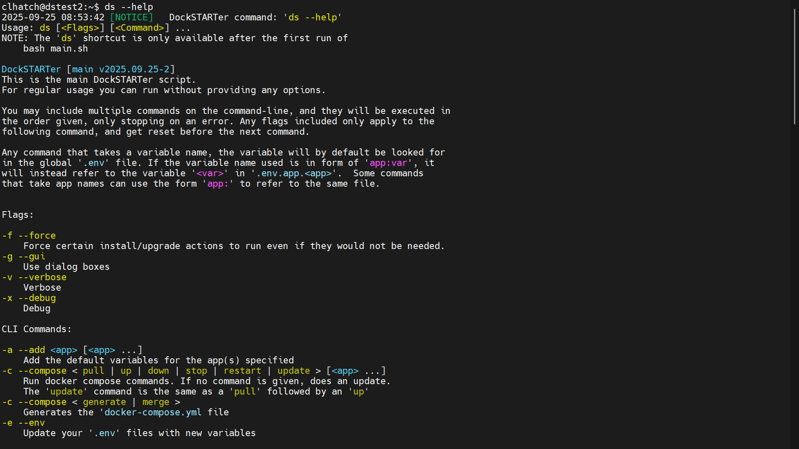

# <!-- Home -->

[](https://dockstarter.com)

[](#supporters)
[](https://dockstarter.com/discord)
[](https://github.com/GhostWriters/DockSTARTer/graphs/contributors)
[](https://github.com/GhostWriters/DockSTARTer/commits/main)
[](https://github.com/GhostWriters/DockSTARTer/blob/main/LICENSE)
[](https://github.com/GhostWriters/DockSTARTer/actions?query=workflow%3ARun%20Tests+branch%3Amain)

The main goal of DockSTARTer is to make it quick and easy to get up and running with Docker.

You may choose to rely on DockSTARTer for various changes to your Docker system or use DockSTARTer as a stepping stone and learn to do more advanced configurations.











## Getting Started

### System Requirements

- You must be running a [supported platform](https://docs.docker.com/install/#supported-platforms) or an operating system based on a supported platform. Platforms named below will link to documentation listing compatible versions.
- You must be logged in as a non-root user with sudo permissions.

### One Time Setup (required)

- APK Systems (Alpine)

  ```bash
  sudo apk add curl git
  bash -c "$(curl -fsSL https://get.dockstarter.com)"
  sudo reboot
  ```

- APT Systems ([Debian](https://docs.docker.com/install/linux/docker-ce/debian/#os-requirements), [Ubuntu](https://docs.docker.com/install/linux/docker-ce/ubuntu/#os-requirements), etc)

  ```bash
  sudo apt-get install curl git
  bash -c "$(curl -fsSL https://get.dockstarter.com)"
  sudo reboot
  ```

  > Raspbian requires a few extra commands

  ```bash
  sudo apt-get update
  sudo apt-get dist-upgrade
  sudo apt-get install curl git
  bash -c "$(curl -fsSL https://get.docker.com)"
  bash -c "$(curl -fsSL https://get.dockstarter.com)"
  sudo reboot
  ```

  > OpenMediaVault (OMV) requires [special instructions found here](https://dockstarter.com/advanced/openmediavault/)

- DNF Systems ([Fedora](https://docs.docker.com/install/linux/docker-ce/fedora/#os-requirements))

  ```bash
  sudo dnf install curl git
  bash -c "$(curl -fsSL https://get.dockstarter.com)"
  sudo reboot
  ```

- Pacman Systems (Arch, Manjaro, EndeavourOS, etc.)

  ```bash
  sudo pacman -Sy curl docker git
  bash -c "$(curl -fsSL https://get.dockstarter.com)"
  sudo reboot
  ```

- YUM Systems ([CentOS](https://docs.docker.com/install/linux/docker-ce/centos/#os-requirements))

  ```bash
  sudo yum install curl git
  bash -c "$(curl -fsSL https://get.dockstarter.com)"
  sudo reboot
  ```

- MacOS Systems ([Homebrew](https://brew.sh))

  ```bash
  brew update
  brew upgrade --cask
  brew upgrade
  brew install --cask docker
  brew install docker-compose
  ```

  or

  ```bash
  brew update
  brew upgrade --cask
  brew upgrade
  brew install docker docker-compose
  ```

  ```bash
  brew install bash curl git grep gnu-sed
  bash -c "$(curl -fsSL https://get.dockstarter.com)"
  sudo reboot
  ```
  Additional Steps for MacOS:
  - Run Docker at start up:
    - In docker desktop (Docker.app) open settings and ensure "Start Docker Desktop when you sign in to your computer" is enabled in the General heading. This step is required to to start docker automatically after a restart and allow DockSTARTer to communicate with the docker daemon.
  - Approve Docker keychain permissions:
    - At least once after installing DockSTARTer open the terminal.app from the MacOS desktop and run the DockSTARTer command ```ds -c```. A keychain access dialog will pop up. Type your MacOS login password into the dialog and click on "Always Allow".
  
<details>
  <summary>Alternate install (any system)</summary>

The standard install above downloads the initial script using a method with some known risks. For those concerned with the security of the above method, here is an alternative:

```bash
## NOTE: Run the appropriate command for your distro
sudo apt-get install curl git
sudo dnf install curl git
sudo pacman -Sy curl git
sudo yum install curl git
brew install bash curl git grep gnu-sed
```

Then

```bash
git clone https://github.com/GhostWriters/DockSTARTer "/home/${USER}/.dockstarter"
bash /home/"${USER}"/.dockstarter/main.sh -vi
sudo reboot
```

</details>

### Running DockSTARTer

```bash
ds
```

To run DockSTARTer, use the command above. You should now see the main menu from the screenshots. Select `Configuration` and then `Full Setup`, and you will be guided through selecting apps and starting containers.

See our [documentation](https://dockstarter.com/introduction/) for more detailed information.

## Support

[](https://dockstarter.com/discord)

Click the chat badge to join us on Discord for support!

[Feature Request](https://github.com/GhostWriters/DockSTARTer/issues/new?template=feature_request.md) | [Bug Report](https://github.com/GhostWriters/DockSTARTer/issues/new?template=bug_report.md)

Additional information can be found on our [Support Page](https://dockstarter.com/basics/support/).

## Contributing

Want to help develop DockSTARTer? Check out our [contributing guidelines](https://github.com/GhostWriters/DockSTARTer/blob/main/.github/CONTRIBUTING.md) and [code of conduct](https://github.com/GhostWriters/DockSTARTer/blob/main/.github/CODE_OF_CONDUCT.md).

### Contributors

[](https://github.com/GhostWriters/DockSTARTer/graphs/contributors)

This project exists thanks to all the people who contribute.
[](https://GitHub.com/GhostWriters/DockSTARTer/graphs/contributors)

## Supporters

Support the project by donating on [Open Collective](https://opencollective.com/DockSTARTer#donation).

### Backers

[](https://opencollective.com/DockSTARTer#backer)

Thank you to all our backers! [Become a backer](https://opencollective.com/DockSTARTer#backer).

[](https://opencollective.com/DockSTARTer#backers)

### Sponsors

[](https://opencollective.com/DockSTARTer#sponsor)

Support this project by becoming a sponsor. Your logo will show up here with a link to your website. [Become a sponsor](https://opencollective.com/DockSTARTer#sponsor).

[](https://opencollective.com/DockSTARTer/tiers/sponsor/0/website)
[](https://opencollective.com/DockSTARTer/tiers/sponsor/1/website)
[](https://opencollective.com/DockSTARTer/tiers/sponsor/2/website)
[](https://opencollective.com/DockSTARTer/tiers/sponsor/3/website)
[](https://opencollective.com/DockSTARTer/tiers/sponsor/4/website)
[](https://opencollective.com/DockSTARTer/tiers/sponsor/5/website)
[](https://opencollective.com/DockSTARTer/tiers/sponsor/6/website)
[](https://opencollective.com/DockSTARTer/tiers/sponsor/7/website)
[](https://opencollective.com/DockSTARTer/tiers/sponsor/8/website)
[](https://opencollective.com/DockSTARTer/tiers/sponsor/9/website)

## Special Thanks

- [SmartHomeBeginner.com](https://www.smarthomebeginner.com) for creating [AtoMiC-ToolKit](https://github.com/htpcBeginner/AtoMiC-ToolKit) that served as this project's primary inspiration, and later [this](https://www.smarthomebeginner.com/docker-home-media-server-2018-basic/) guide that provided some initial direction with Docker.
- [LinuxServer.io](https://www.linuxserver.io) for maintaining most Docker images used in this project.
